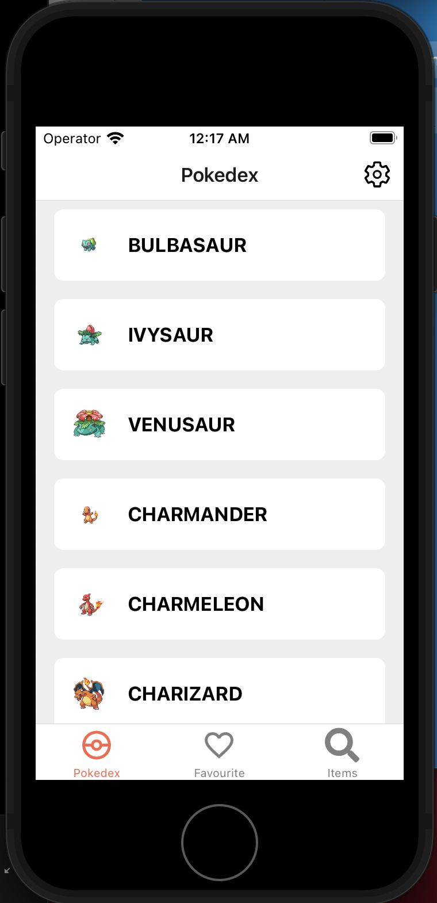
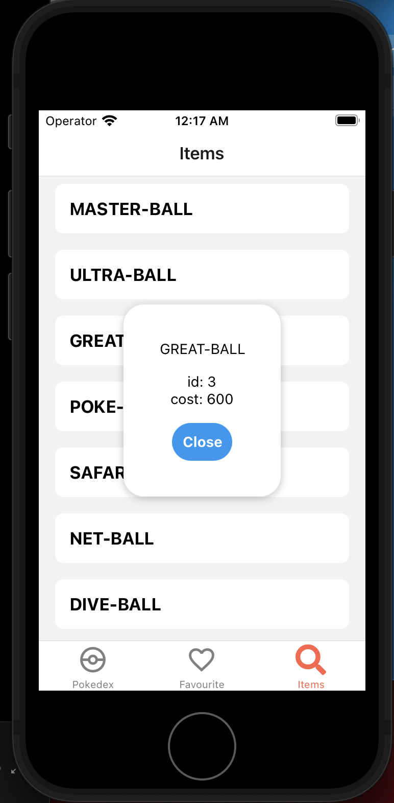
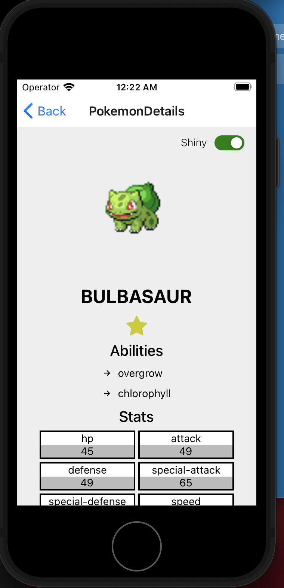
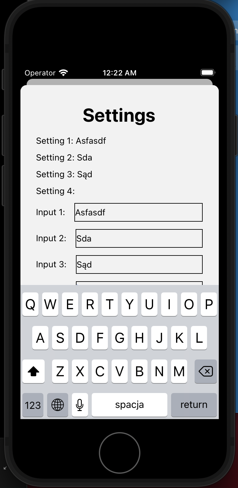

PokemonMobileApp
---

App is made using React-Native. Data is fetched from PokeApi(https://pokeapi.co) using REST API and GraphQL. 

### Screens

#### Pokedex

#### Favourite

#### Items

#### Pokemon Details

#### Settings

### Basic Flow/Animations

